# BlinkShop - E-Commerce App

BlinkShop is a fully functional **e-commerce application** built using **Kotlin**, following the **MVVM architecture**. It provides a seamless shopping experience with features like authentication, product management, cart functionality, and payment integration.

## 📌 Features
- **👥 User & Admin Modules**: Two separate experiences – customers can browse and shop, while admins can manage products, orders, and user data.
- **🔐 Secure Authentication**: Sign up and log in seamlessly using Firebase Authentication, ensuring data security and a smooth user experience.
- **🛍️ Smart Product Management**: Admins can effortlessly add, edit, delete, and manage products, keeping the store up to date with the latest offerings.
- **🛒 Intuitive Cart & Easy Checkout**: Users can add or remove products to their cart and proceed with a seamless checkout process.
- **💳 Hassle-Free Payments**: Integrated Razorpay for quick, secure, and convenient online payments.
- **🔍 Powerful Search & Smart Filters**: Easily find products with a dynamic search bar and apply category filters for a personalized shopping experience.
- **🚚 Live Order Tracking**: Keep customers engaged with real-time updates on their order status. They always know where their package is and when it's arriving!
- **🌙 Adaptive Dark Mode**: Whether you're shopping during the day or at midnight, the UI automatically adjusts to your system theme for a comfortable experience.
- **⚡️ Swipe-Based Delivery Partner Access**: With a simple swipe in four directions, the Delivery Partner Dashboard opens up, making it easier for partners to track and manage deliveries.
- **📍 Real-Time Location Sharing**: Both the customer and the delivery partner can see each other's location, ensuring better coordination and faster deliveries.

## 🏗️ Architecture & Design Pattern
BlinkShop follows the **MVVM (Model-View-ViewModel) architecture**, ensuring a clean separation of concerns and better maintainability.

- **Model**: Defines data structures and business logic.
- **View**: UI layer (XML).
- **ViewModel**: Handles UI logic, LiveData, and communicates with repositories.
- **Repository**: Manages data sources (Firebase, API calls, local storage).

## 🛠️ Tech Stack
- **Language**: Kotlin
- **UI Framework**: XML 
- **Architecture**: MVVM
- **Database**: Firebase Firestore
- **Networking**: Retrofit + Coroutines
- **State Management**: LiveData & ViewModel
- **Payment Integration**: Razorpay
- **Local Storage**: Shared Preferences/Room Database
- **Version Control**: Git & GitHub

## 🚀 Installation & Setup
### Prerequisites
- Android Studio (latest version)
- Firebase Project with Firestore setup
- Razorpay API Key

### Steps
1. **Clone the Repository**
   ```sh
   git clone https://github.com/Sumit-22/shopping-cart.git
   ```
2. **Open in Android Studio**
3. **Configure Firebase**
   - Add `google-services.json` to the `app/` directory.
4. **Run the App**
   - Build and install the app on an emulator or physical device.

## 🎥 Demo Video
<p align="start">
  <a href="https://youtube.com/shorts/Mr7UwQQLoaE?si=pqh0X19FhZbbaMjB">
    
  </a>
</p>


## 📸 Screenshots

<p align="center">

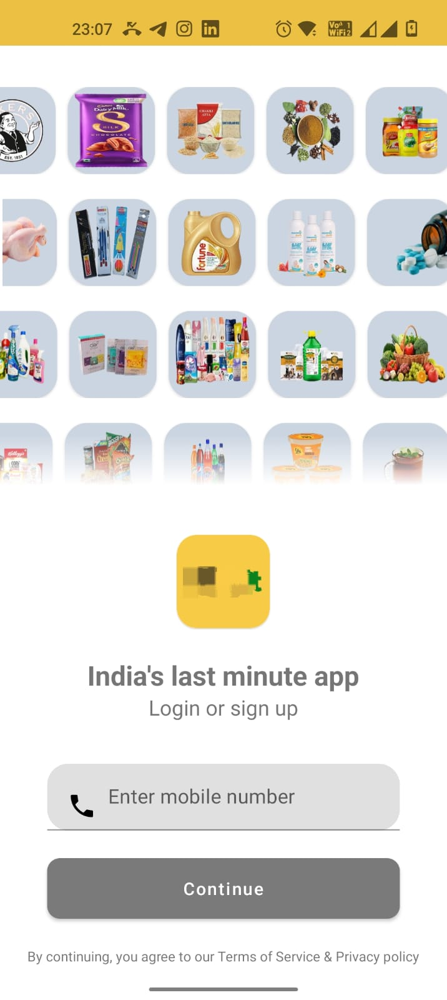
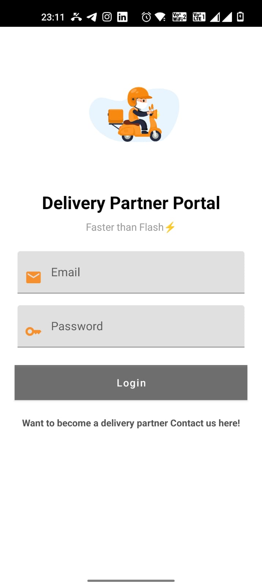
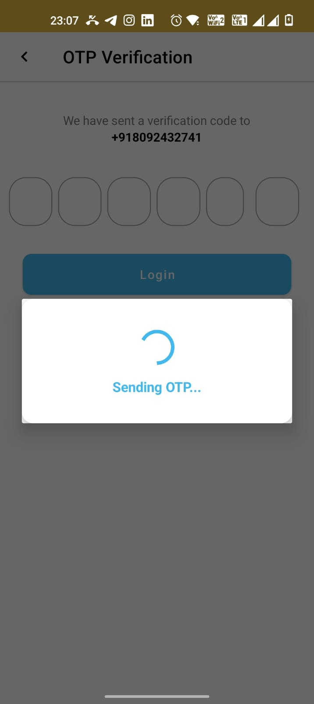
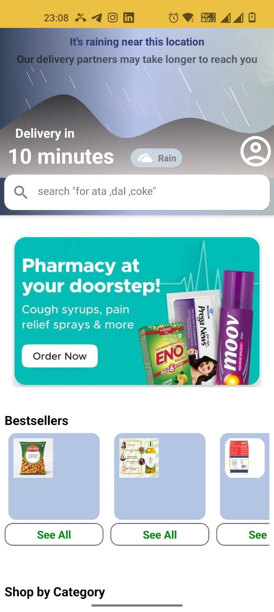
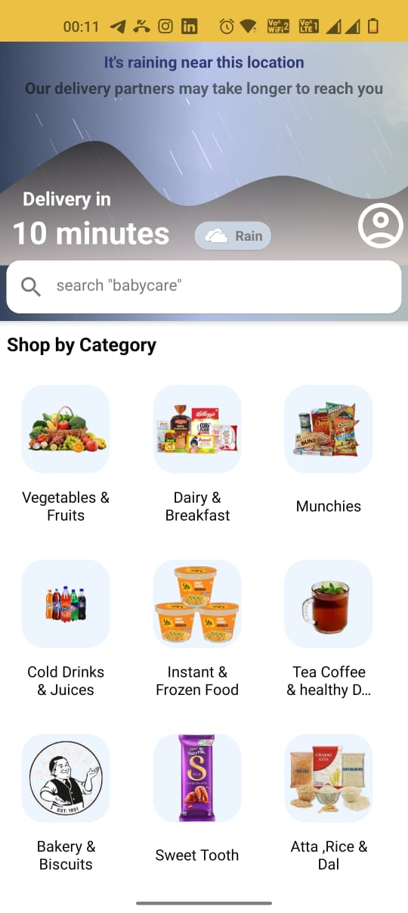
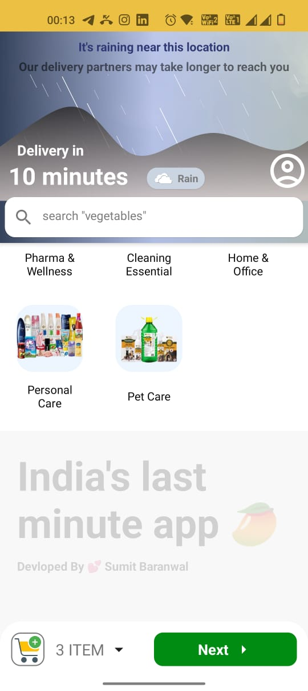
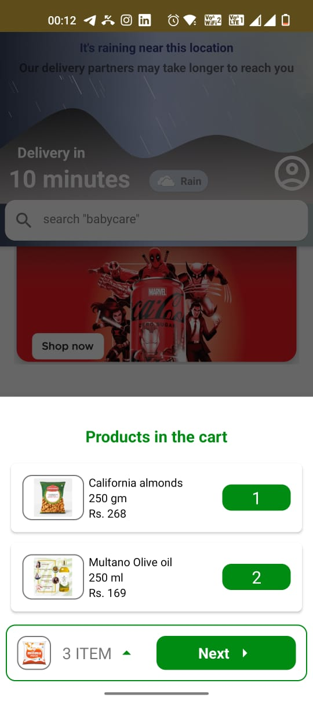
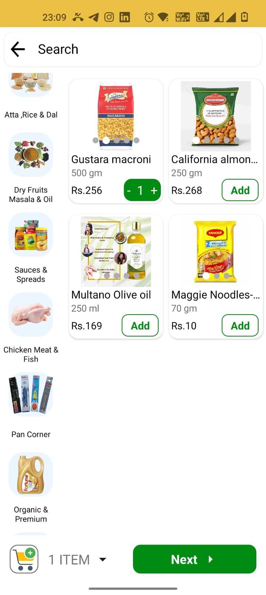
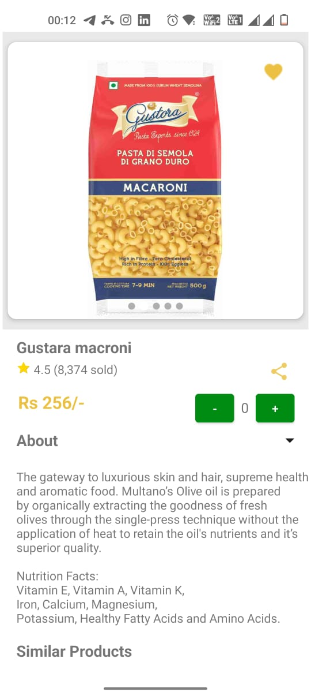
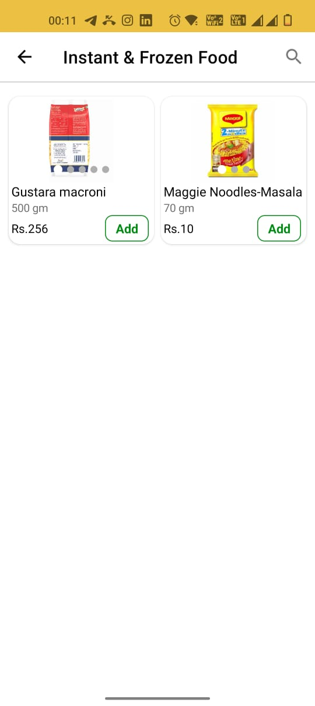
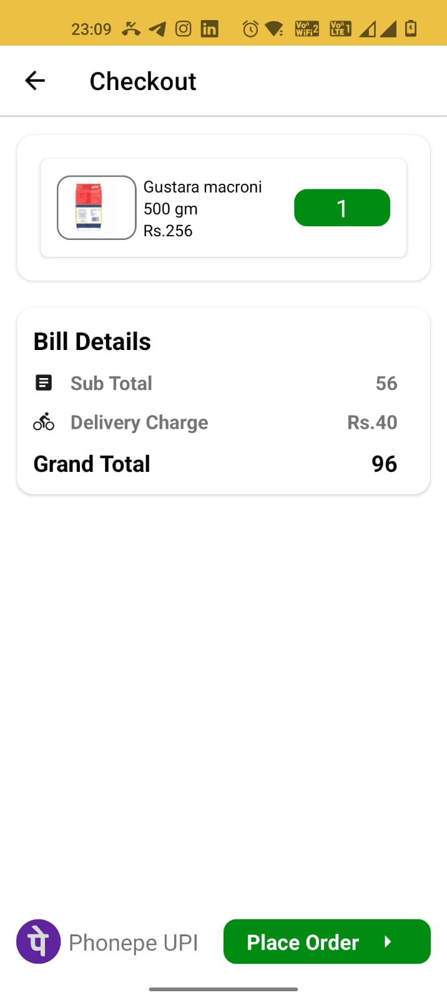
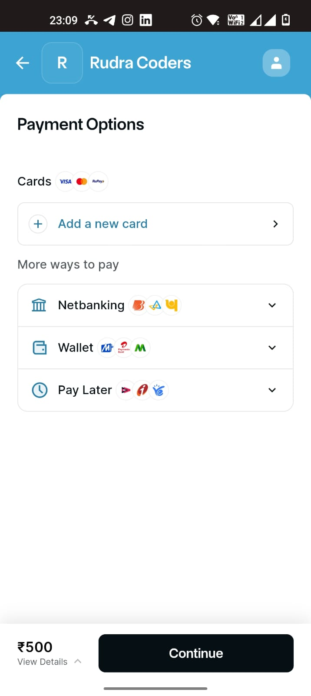
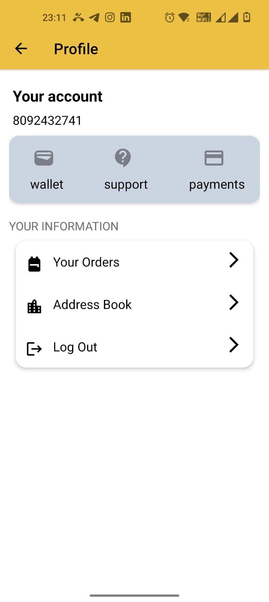
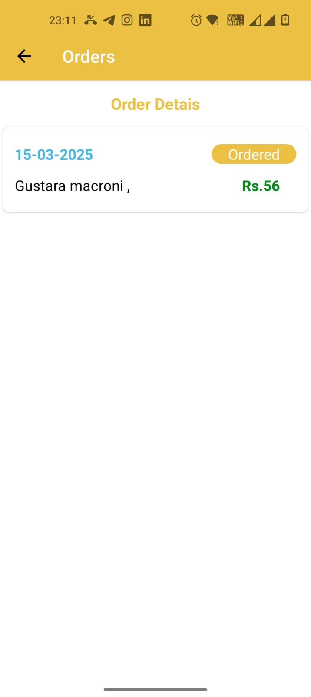
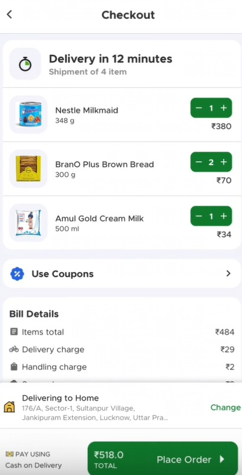

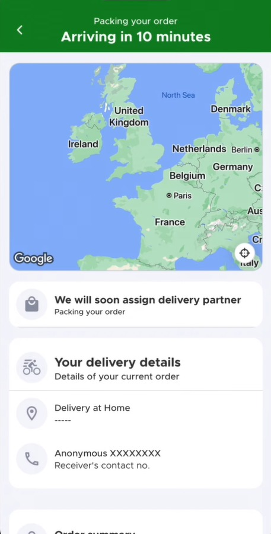
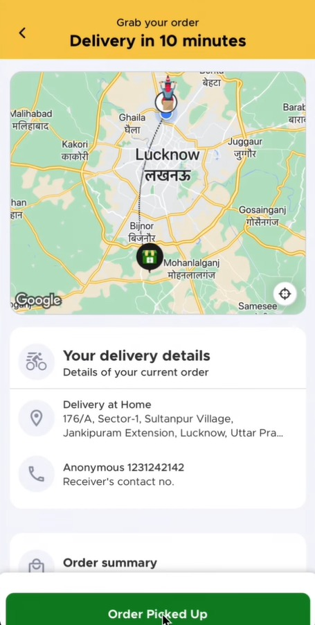
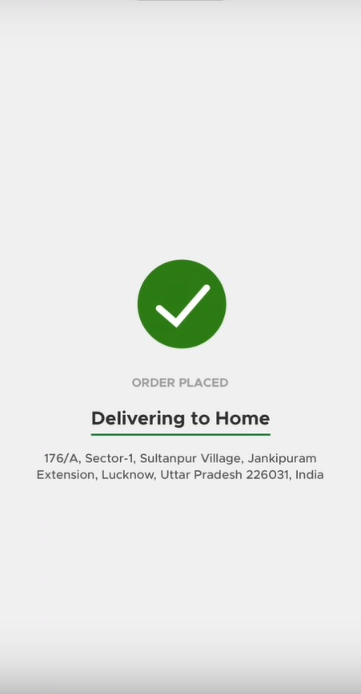
</p>

## 🛠️ Future Enhancements
- Implement GraphQL for better API performance.
- Add Wishlist functionality.
- Introduce AI-powered product recommendations.
- Implement push notifications for order updates.
- Integrate voice search functionality

## 🤝 Contributing
Contributions are welcome! Feel free to fork the repository and submit a PR.

## 📄 License
This project is licensed under the MIT License - see the [LICENSE](LICENSE) file for details.

---
🔥 Developed with ❤️ by [Sumit Kumar](https://github.com/Sumit-22)
